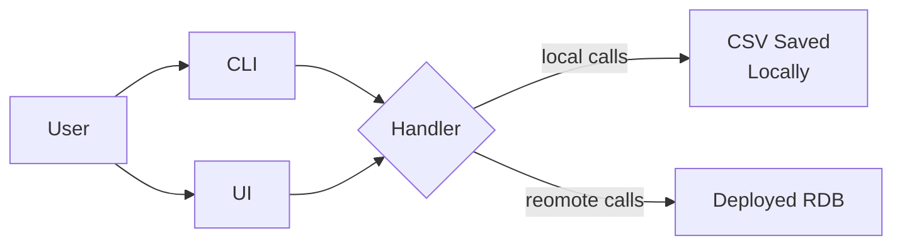

## High Level Design

## Handler Components
- Gonna use SQLite to import the data in form a csv.
- Storing the SQL data on machine at the location where the binary is.
- This can be interacting using CLI & UI.

# TODO
- [X] Add export and import functionality.
- [] Add querying functionality.
- [] Add filtering based on tags.
    - [] Explore DB approach creating separate table to store references.
    - [] Explore redis to create cached references on initialisation.

